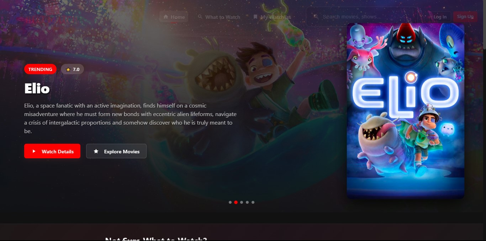

# NextWatch - Your Personal Movie and TV Platform

NextWatch is a modern movie and TV discovery platform that helps you find, save, and enjoy great content. It combines search, personalized recommendations, and a quick quiz to make choosing what to watch simple.



## Features

- Search and discovery by genre, rating, or mood
- Personalized quiz recommendations
- Watchlist for saved titles
- Email and Google sign-in
- Trending and popular sections
- Responsive design for desktop, tablet, and mobile

## Getting Started

### Prerequisites

- Node.js (v14+)
- npm or yarn

### Installation

1. Clone the repository:
   ```bash
   git clone https://github.com/Omm-codes/NEXTWATCH.git
   cd nextwatch
   ```

2. Install dependencies:
   ```bash
   npm install
   # or
   yarn install
   ```

3. Create a `.env` file in the root directory with the following variables:
   ```env
   # TMDB API Configuration
   REACT_APP_TMDB_API_KEY=your_tmdb_api_key
   REACT_APP_TMDB_BASE_URL=https://api.themoviedb.org/3

   # Firebase Configuration
   REACT_APP_FIREBASE_API_KEY=your_firebase_api_key
   REACT_APP_FIREBASE_AUTH_DOMAIN=your_project.firebaseapp.com
   REACT_APP_FIREBASE_PROJECT_ID=your_project_id
   REACT_APP_FIREBASE_STORAGE_BUCKET=your_project.appspot.com
   REACT_APP_FIREBASE_MESSAGING_SENDER_ID=your_sender_id
   REACT_APP_FIREBASE_APP_ID=your_app_id
   ```

4. Start the development server:
   ```bash
   npm start
   # or
   yarn start
   ```

5. Open `http://localhost:3000` to view the app.

## Project Structure

```
nextwatch/
  public/
    index.html
    manifest.json
    favicon.ico
  src/
    components/         # Reusable UI components
    pages/              # Page components
    services/           # API and Firebase logic
    contexts/           # React contexts
    assets/             # Images and static files
    styles/             # Global styles
    utils/              # Utility functions
  .env
  package.json
  README.md
```

## Technologies Used

- React
- Firebase (Authentication, Firestore)
- TMDB API
- CSS3

## Key Features and Usage

### Search and Discovery
Find movies, TV shows, and web series by name, genre, or mood. Use filters to narrow results.

### Personalized Quiz
Take a quick quiz to get recommendations tailored to your mood and preferences.

### Watchlist
Save your favorite content and keep track of what you want to watch next.

### User Accounts
Sign up with email or Google, manage your profile, and sync your watchlist across devices.

### Trending and Popular
Stay up-to-date with trending and highly rated content.

## Deployment

### Build for Production
```bash
npm run build
```

### Deploy to Firebase Hosting
```bash
npm install -g firebase-tools
firebase login
firebase init hosting
firebase deploy
```

### Deploy to Netlify or Vercel
- Build the project: `npm run build`
- Drag and drop the `build` folder to Netlify or use the `vercel` CLI

## Contributing

We welcome contributions:

1. Fork the repository
2. Create a new branch (`git checkout -b feature/YourFeature`)
3. Commit your changes (`git commit -m "Add some feature"`)
4. Push the branch (`git push origin feature/YourFeature`)
5. Open a pull request

## License

This project is licensed under the MIT License. See [LICENSE](LICENSE).

## Contact

- Om Chavan - [LinkedIn](https://www.linkedin.com/in/om-chavan003) | [Instagram](https://www.instagram.com/om_chavan_003)
- Email: [omsanjay975@gmail.com](mailto:omsanjay975@gmail.com)

---

Made with love by Om Chavan for movie lovers everywhere.

*NextWatch - Discover. Watch. Enjoy.*
